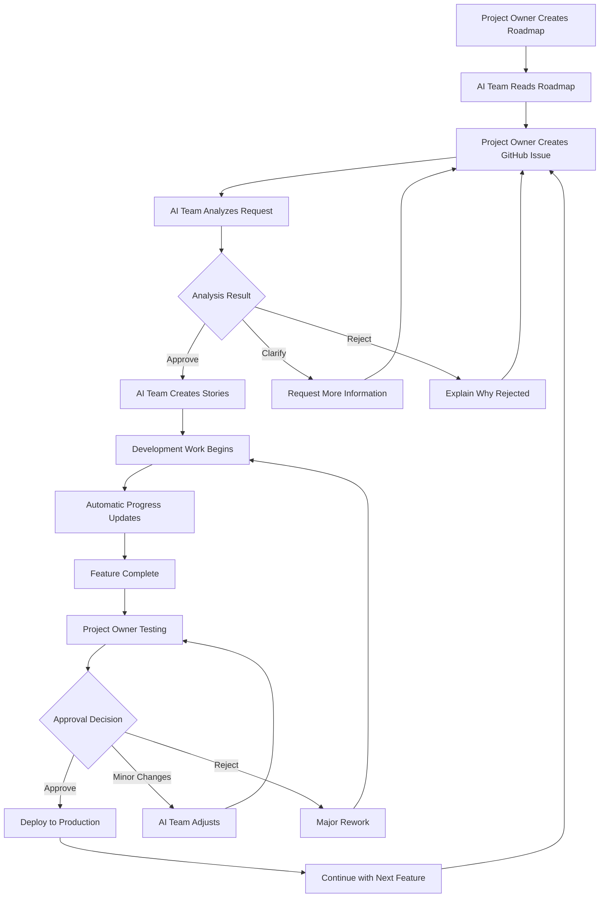

# Project Owner's Guide to Managing Your AI Development Team

*A comprehensive guide for project owners who want to understand how to direct and communicate with the DigiNativa AI-Team*

## 🎯 Overview: How to Direct Your AI Team

As a project owner, you work with a fully autonomous AI team that can develop features from idea to finished implementation. The team follows your directives but works independently between your decision points.

### Your Responsibility as Project Owner

**Strategic Planning**: Decide which features to build and in what order  
**Quality Approval**: Review and approve/reject completed features  
**Course Corrections**: Provide feedback when the team needs to change direction

### AI Team's Responsibility

**Technical Implementation**: Build everything from UX design to code and tests  
**Quality Assurance**: Follow all technical standards and design principles  
**Continuous Reporting**: Keep you updated on progress and problems

---

## 📋 Phase 1: Plan Your Project (Roadmap)

### How to Create Your Plan

#### 1. Define Your Features in roadmap.md
Create a file called `docs/dna/roadmap.md` where you list all features you want:

```markdown
# My Project Plan

## Current Sprint (ongoing work)
- [ ] Feature 1: User authentication (Priority: High)
- [ ] Feature 2: Basic game mechanics (Priority: High)

## Next Sprint (planned)  
- [ ] Feature 3: Progress reporting (Priority: Medium)
- [ ] Feature 4: Mobile optimization (Priority: Medium)

## Future features (wishlist)
- [ ] Feature 5: Advanced analytics (Priority: Low)
```

#### 2. Set Priorities

**High Priority**: Must be done first, blocks other work  
**Medium Priority**: Important features that can wait  
**Low Priority**: Nice-to-have for the future

#### 3. Describe Dependencies
If certain features must be done before others, write it clearly:

```markdown
- Feature 3 requires Feature 1 (authentication) to be completed first
- Feature 4 can be done in parallel with other features
```

#### What Happens Next?

✅ AI team automatically reads your roadmap  
✅ Project Manager selects next feature based on priority and dependencies  
✅ You get notification when team starts working on each feature

---

## 🎪 Phase 2: Communicate Feature Requests (GitHub Issues)

### How to Order Features

#### 1. Create a GitHub Issue

- Go to your project's GitHub repository
- Click "New Issue" → "Feature Request"
- Fill in the structured template

#### 2. Describe Your Feature Clearly
Use this structure:

```markdown
Title: Add user registration

As [Anna, public sector employee]
I want [to be able to create an account]  
so that [my learning progress is saved between sessions]

Acceptance Criteria:
- [ ] Users can register account with email
- [ ] Password is validated securely
- [ ] Progress is saved automatically
- [ ] Works on mobile and desktop
```

#### 3. Set Priority and Timeline

- Select priority level in template
- Indicate if urgent or can wait
- Describe any deadlines

### What Happens Next?

Within 24 hours you get a response from the AI team that looks like this:

```markdown
🤖 AI-Team Analysis Complete

✅ RECOMMENDATION: APPROVED
💭 Reasoning: Feature aligns with project goals and 
   is technically feasible

📊 Planning:
- Estimated stories: 4
- Estimated time: 6 days  
- Required agents: Game Designer, Developer, Test Engineer, QA Tester

🚀 Next steps:
AI team will now:
1. Create detailed stories for implementation
2. Begin development work according to workflow
3. Report progress continuously
```

---

## 🔄 Phase 3: Follow Development Work

### Automatic Reporting
You receive automatic updates when:

- AI team starts working on a new feature
- Major milestones are reached (design complete, code complete, tests complete)
- Problems arise that may affect timeline
- Feature is ready for your approval

### Example Progress Report

```markdown
🔄 Development Progress - User Registration (#123)

Completed stories:
✅ UX specification (Game Designer) 
✅ Backend API (Developer)
🔄 Frontend components (Developer) - 80% complete

Next: QA testing (estimated completion: 2 days)
Live preview: https://preview-123.netlify.app
```

### How to Follow the Work

**GitHub Issues**: Check specific features and their progress  
**Live Previews**: Test features while they're being developed  
**Automatic Notifications**: Get updates in your email/Slack  
**Weekly Reports**: Summary of what has happened

---

## ✅ Phase 4: Approve or Reject Completed Features

### When a Feature is Complete
You get a notification that looks like this:

```markdown
🎉 Feature ready for approval: User Registration (#123)

✅ All quality checks passed
✅ Tested from end-user perspective  
✅ Follows all design principles
✅ Performance: 95/100 (Lighthouse score)

🔗 Test yourself: https://preview-123.netlify.app
📊 Test report: [link to detailed report]

Please approve or reject this feature.
```

### Your Options

#### 🟢 Approve Feature

- Click "Approve" in GitHub Issue
- Feature is automatically deployed to production
- AI team continues with next priority

#### 🟡 Request Minor Changes

- Comment on what needs to be adjusted
- AI team makes changes and returns
- You get to test again when it's ready

#### 🔴 Reject Feature

- Explain what is wrong or missing
- AI team analyzes feedback and suggests new approach
- Major rework is done according to your directives

### Example Feedback

```markdown
I tested the registration function:

✅ Good: Easy to use, fast registration
✅ Good: Works perfectly on mobile  
⚠️  Issue: Password requirements are unclear to user
❌ Problem: Registration form is too long

Request changes:
1. Add clear text about password requirements
2. Simplify form - just email and password is enough
3. Add "Show password" button

Priority: Medium (not critical but should be fixed)
```

---

## 🎛️ Advanced Control

### Change Priorities Mid-Work
If you need to change plans:

#### 1. Update roadmap.md

- Move features between sprint categories
- Change priority levels
- Add new dependencies

#### 2. Communicate Changes

- Comment in relevant GitHub Issues
- AI team adapts their work automatically
- You get confirmation of plan changes

### Handle Urgent Features
**Critical feature (must be done now):**

- Create GitHub Issue with "Critical Priority"
- Tag as "urgent"
- AI team pauses ongoing work and starts immediately

### Quality Control
You can set specific requirements:

**Performance**: "Must load under 2 seconds"  
**Accessibility**: "Must work with screen readers"  
**Security**: "Requires extra security review"  
**Design**: "Must follow our brand guidelines"

---

## 📊 Overview and Reporting

### Weekly Summary
Every Friday you get an automatic report:

```markdown
📈 Weekly Report - AI Team Performance

Features completed this week: 2
- ✅ User registration (approved)
- ✅ Basic game mechanics (approved)

Ongoing work:
- 🔄 Progress reporting (75% complete, delivery Monday)

Next week:
- 📋 Mobile optimization (starting Tuesday)
- 📋 Push notifications (planned start Thursday)

Team performance:
- ⚡ Average delivery time: 4.2 days
- ✅ Quality score: 94/100
- 🎯 Approval rate: 92%
```

### Project Overview Dashboard
You get access to a live dashboard showing:

- Current team status (what is each AI agent doing now?)
- Upcoming deliveries and timelines
- Quality statistics and trends
- Budget and resource usage

---

## 🚨 When Something Goes Wrong

### Automatic Problem Handling
The AI team handles most problems themselves:

**Technical errors**: Debugging and rework  
**Quality issues**: Automatic correction  
**Minor design problems**: Internal coordination

### When You Need to Be Involved
You are contacted only when:

- Problems significantly affect delivery times
- Technical decisions require your strategic input
- Budget or resources risk being exceeded
- Quality problems that the AI team cannot solve themselves

### Escalation looks like this:

```markdown
🚨 Escalation needed - Mobile Optimization (#124)

Problem: Performance requirements cannot be met with current approach
Impact: 3 days delay, may affect next sprint
AI team's suggestions: 
1. Compromise performance for faster delivery
2. Rework architecture (3 extra days)
3. Split into smaller parts and deliver incrementally

Your input needed: Which approach do you prefer?
Decision deadline: Tomorrow 12:00 PM
```

---

## 💡 Tips for Successful AI Team Management

### Do's ✅

**Be specific**: The clearer the instructions, the better the results  
**Test early**: Check previews and give feedback quickly  
**Prioritize hard**: Focus on 2-3 features at a time for best quality  
**Trust the process**: AI team follows proven quality standards

### Don'ts ❌

**Don't micromanage**: Let the team work between your decision points  
**Don't constantly change requirements**: Let features be completed before new requests  
**Don't skip testing**: Take time to review before approval  
**Don't ignore feedback**: AI team learns from your comments

### Optimal Work Pace

**1-2 features per week**: Sustainable pace for high-quality deliveries  
**Approvals within 48h**: Keep the flow going with quick decisions  
**Planning every other week**: Update roadmap regularly

---

## 🎯 Conclusion: Simple but Powerful

With this system you get:

✅ **Full control** over what is built and when  
✅ **Automatic quality assurance** according to industry standards  
✅ **Transparent communication** about progress and problems  
✅ **Flexible adaptation** when needs change

Your AI team functions as an extension of your own decision-making - it executes your vision with professional quality while you focus on strategy and business development.

---

## 📊 Visual Workflow Overview



## 🔧 GitHub Templates Integration

This guide works seamlessly with the GitHub Issue templates:

- **Feature Request Template**: Creates structured requests AI team can understand
- **Bug Report Template**: Reports issues that need AI team attention  
- **Feature Approval Template**: Provides structured feedback on completed work

The AI team automatically processes these templates and responds with structured analysis and progress updates.