# Project Owner's Guide to Managing Your AI Development Team (Priority Queue System)

*A comprehensive guide for project owners who want to understand how to direct and communicate with the DigiNativa AI-Team*

## 🎯 Overview: How to Direct Your AI Team

As a project owner, you work with a fully autonomous AI team that can develop features from idea to finished implementation. The team follows a **Priority Queue** - a smart priority system that automatically selects the next feature based on your prioritizations.

### Your Responsibility as Project Owner

**Feature Prioritization**: Decide which features are most important via GitHub Issues  
**Dependency Management**: Specify if features depend on each other  
**Quality Approval**: Review and approve/reject completed features  
**Course Corrections**: Change priority or provide feedback at any time

### AI Team's Responsibility

**Intelligent Prioritization**: Automatically selects next feature based on priority + dependencies  
**Technical Implementation**: Build everything from UX design to code and tests  
**Quality Assurance**: Follow all technical standards and design principles  
**Continuous Reporting**: Keep you updated on progress and problems

---

## 📋 Phase 1: Create and Prioritize Features

### How to Create a Feature Request

#### 1. Go to GitHub Issues

- Open your project's GitHub repository
- Click "New Issue" → "Feature Request"
- Fill in the structured template

#### 2. Describe Your Feature Clearly

```markdown
Title: Add user registration

As [Anna, public sector employee]
I want [to be able to create an account]  
so that [my learning progress is saved between sessions]

Acceptance Criteria:
- [ ] Users can register account with email
- [ ] Password is validated securely
- [ ] Progress is saved automatically
- [ ] Works on mobile and desktop
```

#### 3. Set Priority (IMPORTANT!)

Select priority level in template:

**P0 - Critical**: Must be done immediately, blocks other work  
**P1 - High**: Important features for current focus  
**P2 - Medium**: Improvements that can wait  
**P3 - Low**: Future wishlist items

#### 4. Specify Dependencies (if relevant)

If this feature requires other features to be completed first:

```markdown
Dependencies: #123, #124
```

or

```markdown
Depends on: User authentication (#123) to be completed first
```

### What Happens Next?

The AI team's Priority Queue works like this:

```
GitHub Issues Repository = AI Team's Priority Queue

[P0] Critical security fix (#125) ← Next to do
[P1] User registration (#123) ← Dependencies clear  
[P1] Progress reporting (#124) ← Waiting for #123
[P2] Mobile optimization (#126) ← Can be done anytime
[P3] Advanced analytics (#127) ← Future feature
```

The AI team automatically selects:

✅ Highest priority first (P0 > P1 > P2 > P3)  
✅ Only features where all dependencies are complete  
✅ Skips features that are already being analyzed

---

## 🤖 Phase 2: AI Team's Automatic Analysis

### Within 24 Hours You Get Automatic Response

```markdown
🤖 AI-Team Analysis Complete

✅ RECOMMENDATION: APPROVED
💭 Reasoning: Feature aligns with project goals and 
   is technically feasible within our architecture

📊 Planning:
- Estimated stories: 4
- Estimated time: 6 days  
- Required agents: Game Designer, Developer, Test Engineer, QA Tester

🚀 Next steps:
AI team will now:
1. 📋 Create detailed stories for implementation
2. 🎨 Game Designer creates UX specification
3. 💻 Developer implements functionality
4. 🧪 Test Engineer creates automated tests
5. 🔍 QA Tester validates from Anna's perspective

Expected delivery time: 6 days
```

### Possible AI Recommendations

#### ✅ APPROVED
- Feature starts immediately
- Story breakdown created automatically
- Development begins according to plan

#### ❓ NEEDS CLARIFICATION
- AI team asks specific questions
- You update Issue description
- Re-analysis happens automatically

#### ❌ NOT APPROVED
- Feature doesn't align with project goals
- Suggestions for alternative approach
- You can revise and resubmit

---

## 🔄 Phase 3: Follow Development Work

### Automatic Progress Reporting

You receive continuous updates:

```markdown
🔄 Development Progress - User Registration (#123)

Completed stories:
✅ STORY-123-001: UX specification (Game Designer) 
✅ STORY-123-002: Backend API (Developer)
🔄 STORY-123-003: Frontend components (Developer) - 80% complete

Next: QA testing (estimated completion: 2 days)
Live preview: https://preview-123.netlify.app

AI team's next priority: #124 (Progress Reporting)
```

### Transparent Workflow

What you can follow:

**GitHub Issues**: For specific features and stories  
**Live Previews**: Test features while they're being developed  
**Automatic Notifications**: Get updates about important milestones  
**Real-time Status**: See what each AI agent is working on

How the AI team prioritizes:

✅ Checks Priority Queue every time a feature completes  
✅ Selects next available high-priority feature  
✅ Respects dependencies automatically  
✅ Reports what happens next

---

## ✅ Phase 4: Approve or Reject Completed Features

### When a Feature is Ready for Approval

```markdown
🎉 Feature ready for approval: User Registration (#123)

✅ All quality checks passed
✅ Tested from end-user perspective (Anna's perspective)
✅ Follows all 5 design principles  
✅ Performance: 95/100 (Lighthouse score)
✅ Accessibility: 98/100 (WCAG compliance)

🔗 Test yourself: https://preview-123.netlify.app
📊 Test report: [link to detailed QA report]

⚡ AI team's next priority: #124 (Progress Reporting)
   Will start automatically when you approve this feature.

Please approve or reject this feature.
```

### Your Options

#### 🟢 Approve Feature
- Comment "APPROVED" in GitHub Issue
- Feature is automatically deployed to production
- AI team picks next feature from Priority Queue

#### 🟡 Request Minor Changes
- Comment specifically what needs adjustment
- Feature gets "needs-changes" label
- AI team makes changes and returns for new review

#### 🔴 Reject Feature
- Explain what is wrong or missing
- Feature goes back for major rework
- You can change priority or requirements in Issue description

---

## 🎛️ Flexible Priority Queue Management

### Change Priority Anytime

#### Raise Priority:
```powershell
# In GitHub Issue, change label from:
priority-p2  →  priority-p1

# AI team sees change and adjusts automatically
```

#### Add Urgent Feature:
- Create GitHub Issue with "priority-p0"
- AI team pauses current work (if lower priority)
- Starts on critical feature immediately

#### Change Dependencies:
```markdown
# Update Issue body from:
Dependencies: #123

# To:
Dependencies: #123, #124
# (Now waits for both before starting)
```

### Live Priority Queue Status

You can always see current queue via GitHub Issues:

```markdown
🎯 Current Priority Queue Status:

🔄 IN PROGRESS:
- #123: User registration (P1) - 80% complete, delivery tomorrow

⏳ READY TO START:
- #124: Progress reporting (P1) - Waiting for #123
- #126: Mobile optimization (P2) - No dependencies  

🚫 WAITING FOR DEPENDENCIES:
- #125: Advanced analytics (P1) - Requires #123 + #124

📋 FUTURE:
- #127: External system integration (P3)
- #128: Reporting functions (P2)
```

### Smart Dependency Management

The AI team understands dependencies automatically:

```markdown
# These formulations all work:
Dependencies: #123, #124
Depends on: #123  
Requires #123 to be completed first
Must complete #123 and #124 before starting
Blocked by: #123
```

---

## 📊 Overview and Control Your Project

### Automatic Project Overview

#### Weekly Report (automatic):

```markdown
📈 Weekly Report - AI Team Priority Queue

Features completed this week: 2
- ✅ #123: User registration (P1) - approved
- ✅ #124: Progress reporting (P1) - approved

Currently in Priority Queue:
- 🔄 #126: Mobile optimization (P2) - in progress, 60% complete
- ⏳ #127: Advanced analytics (P1) - ready to start  
- ⏳ #128: Reporting functions (P2) - ready to start

Team performance:
- ⚡ Average delivery time: 4.2 days/feature
- ✅ Approval rate: 92% (directly approved)
- 🎯 Next week's plan: 2-3 features from P1/P2 queue
```

### Dashboard for Real-time Status

```markdown
🎛️ AI-Team Dashboard (Live)

Current Status:
👥 Game Designer: Working on UX spec for #126
💻 Developer: Coding frontend for #126  
🧪 Test Engineer: Writing tests for #126
🔍 QA Tester: Waiting for #126 for testing
⚡ Quality Reviewer: Waiting for code to review

Priority Queue:
1. #126 (P2) - 60% complete
2. #127 (P1) - ready to start  
3. #128 (P2) - ready to start
4. #129 (P3) - future

Estimated delivery: #126 tomorrow, #127 starts Thursday
```

---

## 🚨 When Something Goes Wrong

### AI Team Handles Most Issues Themselves

**Automatic problem solving:**

✅ Technical errors → debugging and rework  
✅ Quality issues → automatic correction  
✅ Dependencies blocking → waits until resolved  
✅ Minor design problems → internal coordination

### When You Need to Be Involved

Escalation to you only occurs for:

⚠️ Deadline risks affecting critical features  
⚠️ Technical decisions requiring strategic input  
⚠️ Dependencies that seem to have wrong priority  
⚠️ Quality problems the AI team cannot solve

### Escalation Example:

```markdown
🚨 Escalation needed - Mobile Optimization (#126)

Problem: Performance requirements (>90) cannot be met with current approach
Impact: 
- 3 days delay on #126
- May affect start of #127 which depends on this

AI team's suggestions:
1. Compromise performance (85 score) for faster delivery  
2. Rework architecture (+3 days, guarantees 95 score)
3. Split feature: basic function now, optimization later

Priority Queue impact:
- #127 can start anyway (no dependency)  
- #128 can be reprioritized to compensate

Your input needed: Which approach do you prefer?
Decision deadline: Tomorrow 12:00 PM
```

---

## 💡 Tips for Effective Priority Queue Management

### Do This ✅

#### Set Clear Priorities
**P0**: Security issues, system crashes, blocking errors  
**P1**: Core functions users are waiting for  
**P2**: Improvements that make experience better  
**P3**: Nice-to-have for the future

#### Use Dependencies Smartly
```markdown
# Clear dependencies:
Dependencies: #123 (user auth), #124 (data model)

# Avoid vague dependencies:  
Dependencies: "when we've fixed the auth system"
```

#### Change Priority Proactively
- Raise priority when deadline approaches
- Lower priority if something is no longer urgent
- Add P0 for acute problems

#### Approve Features Quickly
- Test within 24-48 hours when notified
- Give specific feedback instead of "it doesn't feel right"
- Approve quickly to keep AI team in flow

### Avoid This ❌

#### Don't Confuse the Priority System
❌ **Wrong**: All features have P1 (high priority)  
✅ **Right**: Spread out P0/P1/P2/P3 based on real importance

#### Don't Constantly Change Requirements
❌ **Wrong**: Change acceptance criteria while feature is developing  
✅ **Right**: Let ongoing feature complete, create new Issue for changes

#### Don't Create Circular Dependencies
❌ **Wrong**: #123 depends on #124, #124 depends on #123  
✅ **Right**: Split features so dependencies go one direction

#### Don't Micromanage the AI Team
❌ **Wrong**: "Why aren't you starting on #127 instead?"  
✅ **Right**: Change priority on #127 so AI team selects it automatically

### Optimal Work Pace

#### Priority Queue Flow:
**2-3 P1 features per week**: Stable delivery pace  
**1 P0 feature per month**: Manageable for acute problems  
**5-10 P2/P3 in backlog**: Provides planning flexibility

#### Approval Cycle:
**24-48h feedback**: Keep AI team in flow  
**Test for real**: Use preview as Anna would  
**Specific feedback**: "Change X to Y" instead of "it doesn't work"

---

## 🎯 Conclusion: Smart and Automatic Management

With the Priority Queue system you get:

✅ **Intelligent prioritization**: AI team always chooses the right feature next  
✅ **Flexible control**: Change priority anytime via GitHub  
✅ **Automatic dependency management**: No features start in wrong order  
✅ **Transparent progress**: See exactly what happens and when  
✅ **Minimal administration**: System manages itself between your decisions

### Your Job as Project Owner:

📝 **Create GitHub Issues** with clear priority  
🔍 **Test and approve** completed features  
🎯 **Adjust priority** when needs change  
📊 **Follow progress** via automatic reports

**The AI team handles the rest** - from technical analysis to finished code! 🚀

---

## 📊 Visual Priority Queue Flow

```mermaid
graph TD
    subgraph "Project Owner Actions"
        A[Create GitHub Issue] 
        B[Set Priority P0-P3]
        C[Specify Dependencies]
        L[Test & Review Feature]
        M{Make Approval Decision}
        N[Change Priority Anytime]
    end
    
    subgraph "AI Team Priority Queue" 
        D[Analyze All Open Issues]
        E[Select Highest Priority Available]
        F[Check Dependencies Clear]
        G[Start Development]
        H[Progress Updates]
        I[Feature Complete]
    end
    
    A --> B
    B --> C
    C --> D
    D --> E
    E --> F
    F --> G
    G --> H
    H --> I
    I --> L
    L --> M
    
    M -->|✅ Approve| O[Deploy & Pick Next from Queue]
    M -->|🔄 Changes| P[Make Adjustments]
    M -->|❌ Reject| Q[Major Rework]
    
    N --> D
    P --> I
    Q --> G
    O --> D
    
    style A fill:#e3f2fd,color:#000
    style B fill:#e8f5e8,color:#000
    style C fill:#fff3e0,color:#000
    style D fill:#f3e5f5,color:#000
    style E fill:#f3e5f5,color:#000
    style F fill:#f3e5f5,color:#000
    style L fill:#e3f2fd,color:#000
    style M fill:#e3f2fd,color:#000
    style O fill:#c8e6c9,color:#000
    style N fill:#ffebee,color:#000
```

