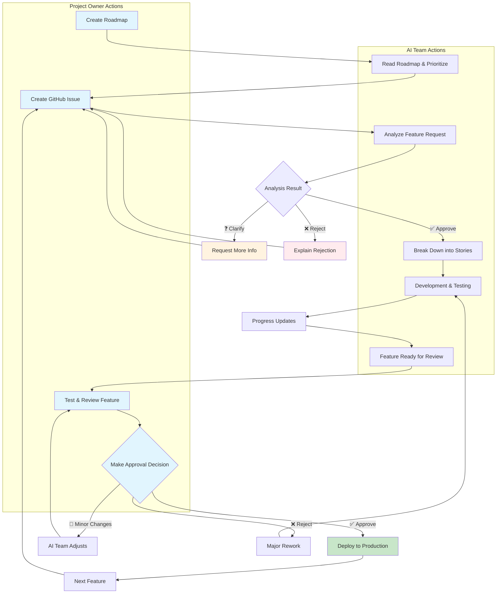
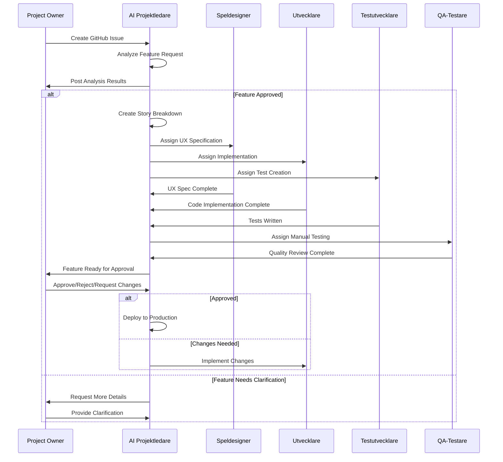
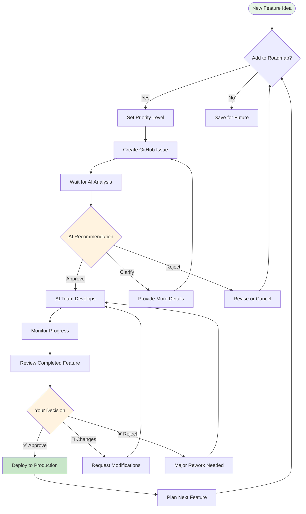
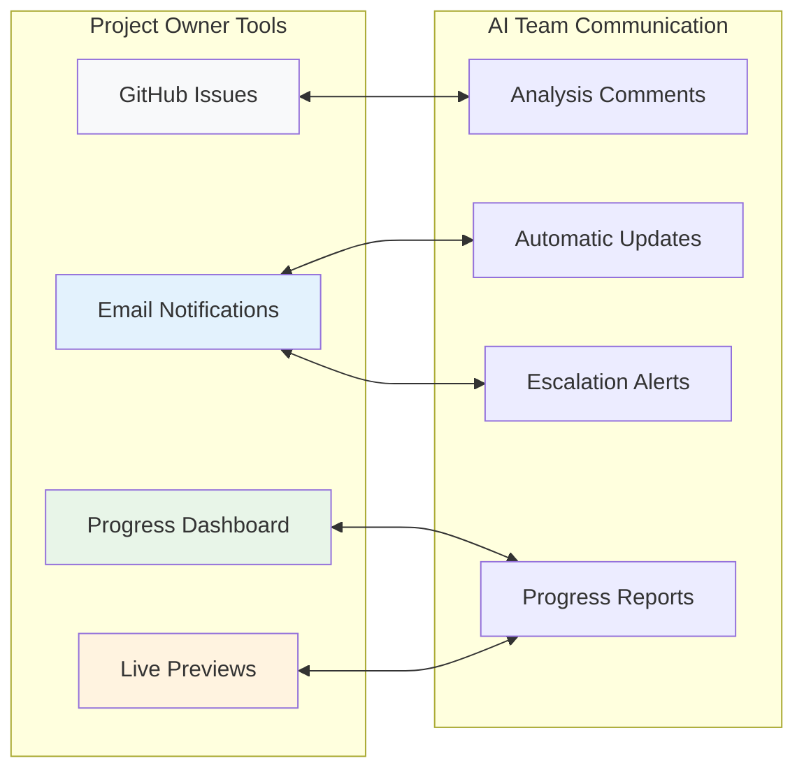
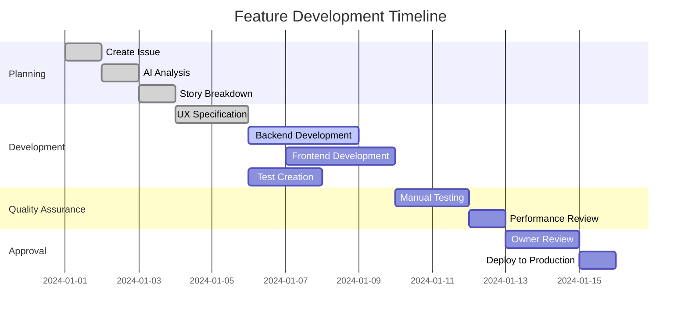
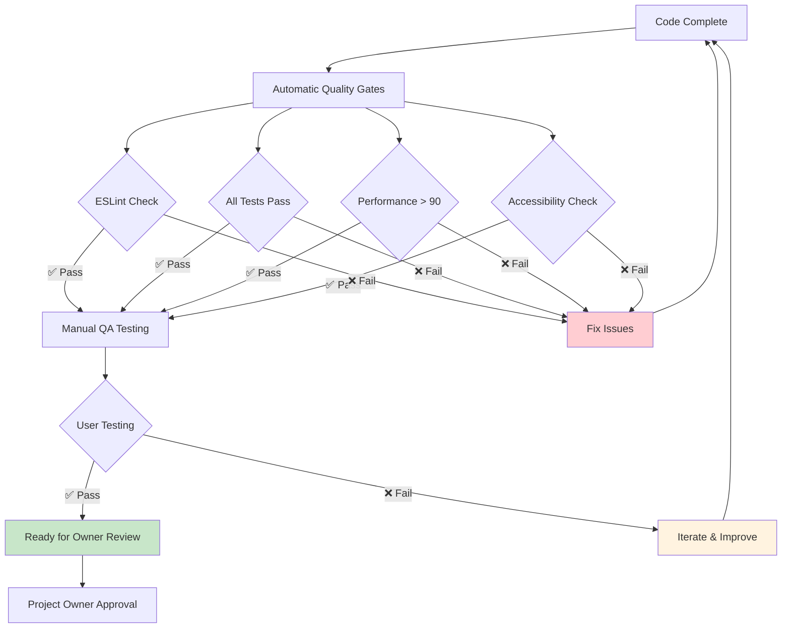
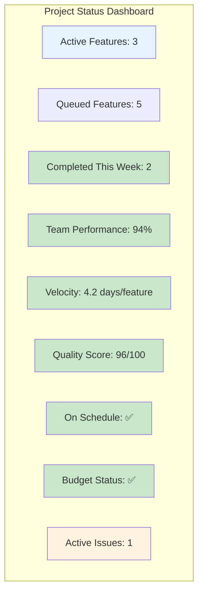

# Visual Workflow Diagrams for Project Owners

## 📊 Complete AI Team Workflow Overview

## 🔄 Feature Development Lifecycle

## 🎯 Decision Points for Project Owners

## 📱 Communication Channels Overview

## ⏱️ Timeline Example: Feature Development

## 🚦 Quality Gates Visualization

## 📈 Project Health Dashboard Mockup

