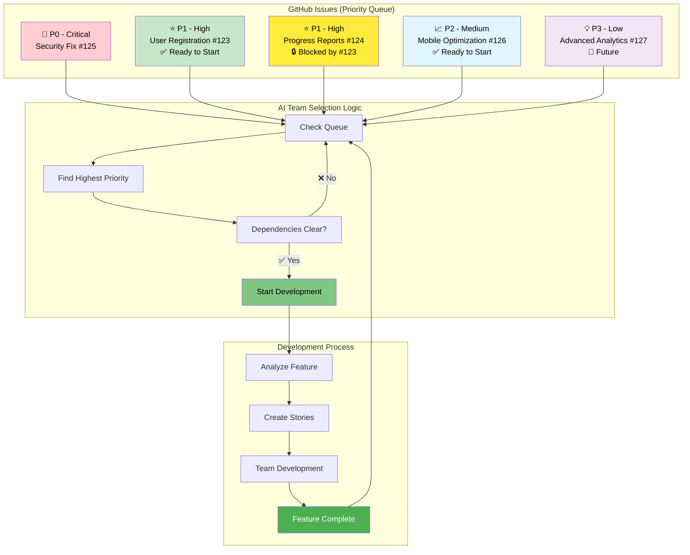
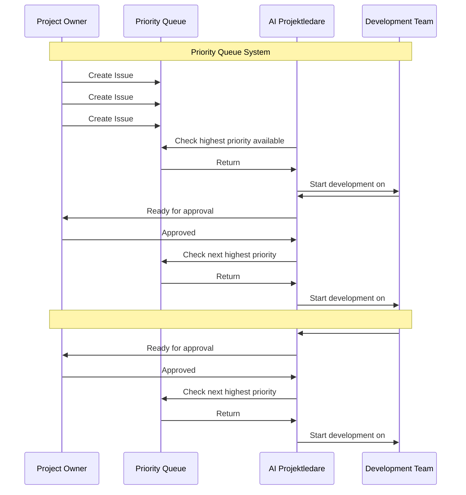
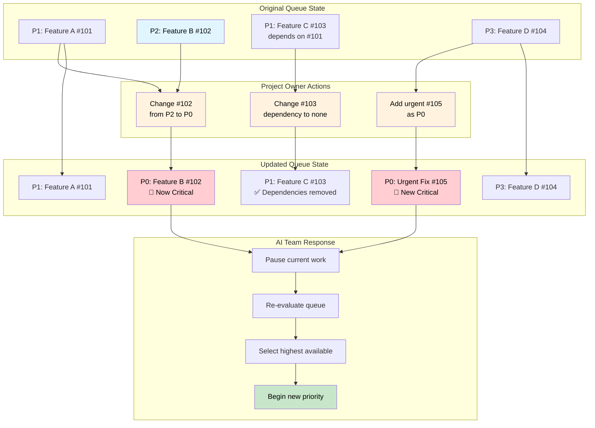
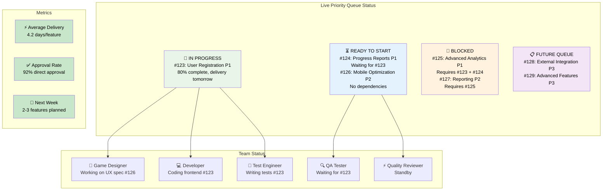
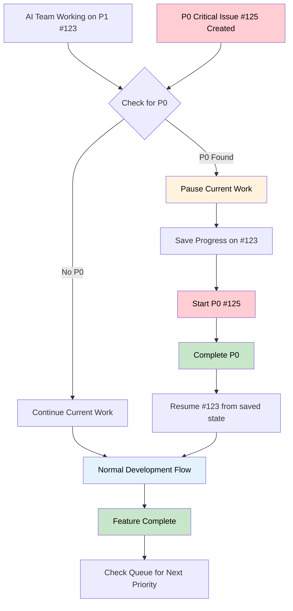
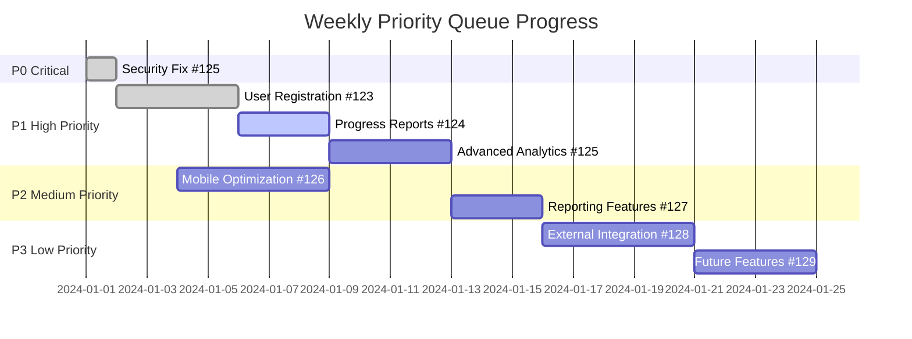
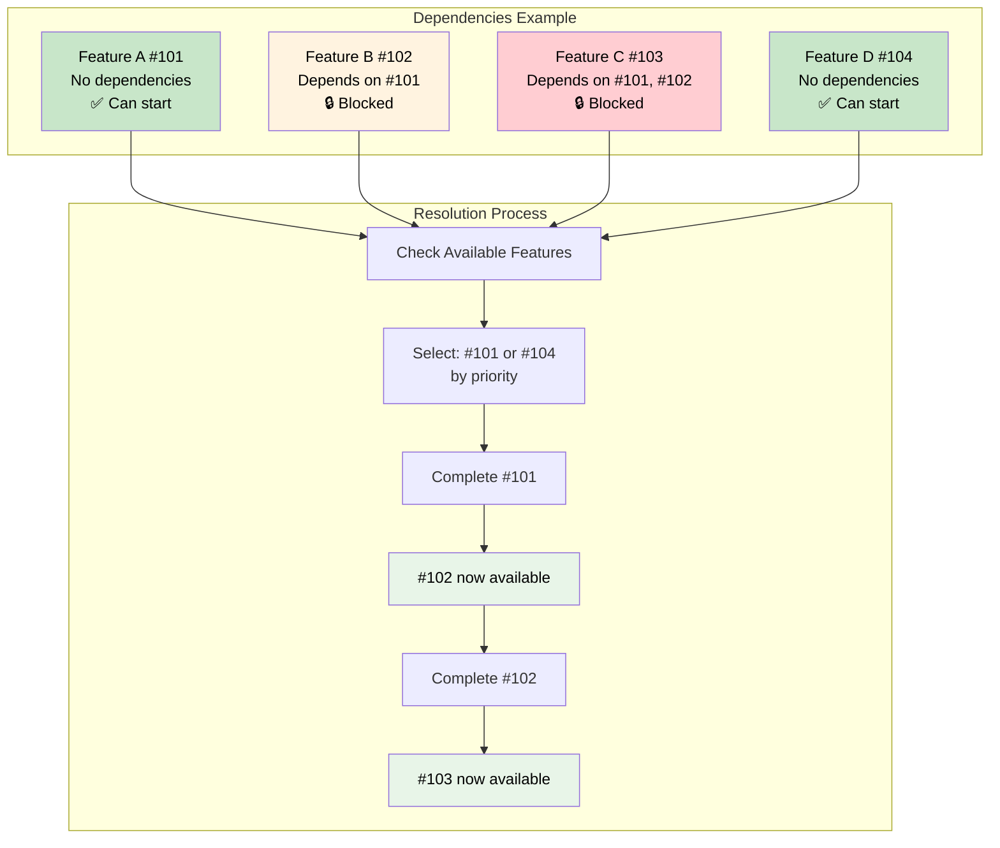
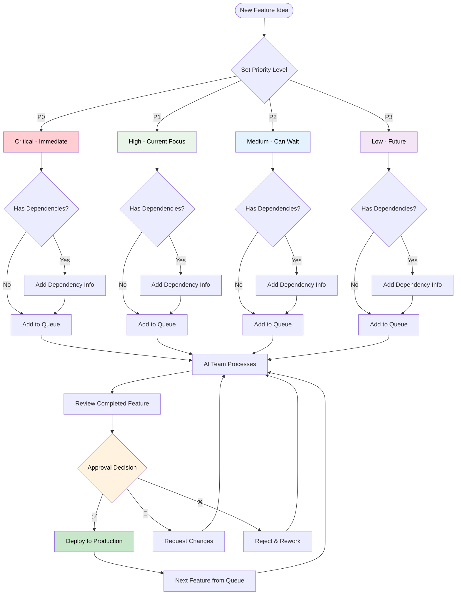

# Visual Workflow Diagrams for Priority Queue System

## 🎯 Priority Queue Management Overview

## 🔄 Feature Development Lifecycle with Priority Queue

## 🎛️ Dynamic Priority Management

## 📊 Priority Queue Status Dashboard

## 🚨 Exception Handling in Priority Queue

## 📈 Weekly Priority Queue Progress

## 🔄 Dependency Resolution Flow

## 🎯 Project Owner Decision Points

